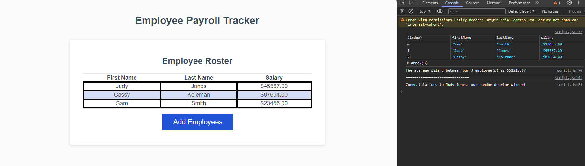

# Employee Payroll Tracker

## Link & Contents
- [The Deployed Page](https://jiske-n.github.io/employee-payroll-tracker/)
- [Further Goals](#further-goals)
- [Potential Issues/Improvements](#potential-issuesimprovements)
- [Key Learnings](#key-learnings)
- [Contributing and Feedback](#contributing-and-feedback)
- [Credits](#credits)
- [Licence](#licence)

## The Employee Payroll Tracker

This page was designed for an employer to be able to input employee names wages and be able to see a table showing all of the input data. Other features include:
-Calculating the average salary of all employees which is shown in the console.
-Randomly selecting one of the employees to be shown in the console.

Goals included, ensuring the table and calculations worked regardless of whether incorrect or incomplete data was added.

- [The Deployed Page](https://jiske-n.github.io/employee-payroll-tracker/)

## Further Goals

Other goals include:
-Writing a good README.
-Ensuring commenting is folowing best practices and in place for ease of future alteration.
-Have all elements of the page working without errors.

## Potential Issues/Improvements

- Condensing some of the code. For example replacing the section converting the first letter to capitalise with a function achieving the same.
- Unsure if the balance for commenting is about right or too sparse/many
- Trying to convert code to be uniform and follow best practice

## Key Learnings

The biggest learning points and hurdles I faced revolved around working out how different elements linked together.

Other learnings include:
- Parse int and float usage.
- Getting a number to show to x decimal places.
- Hopefully, improved commenting.
- Converting units to string and numbers.

## Contributing and Feedback

If you find any issues or have contributions or feedback you can do so by opening an [issue](https://github.com/Jiske-N/employee-payroll-tracker/issues) on Github.

## Credits

Starter code provided by edX/Monash University

## Licence

None presently. 
